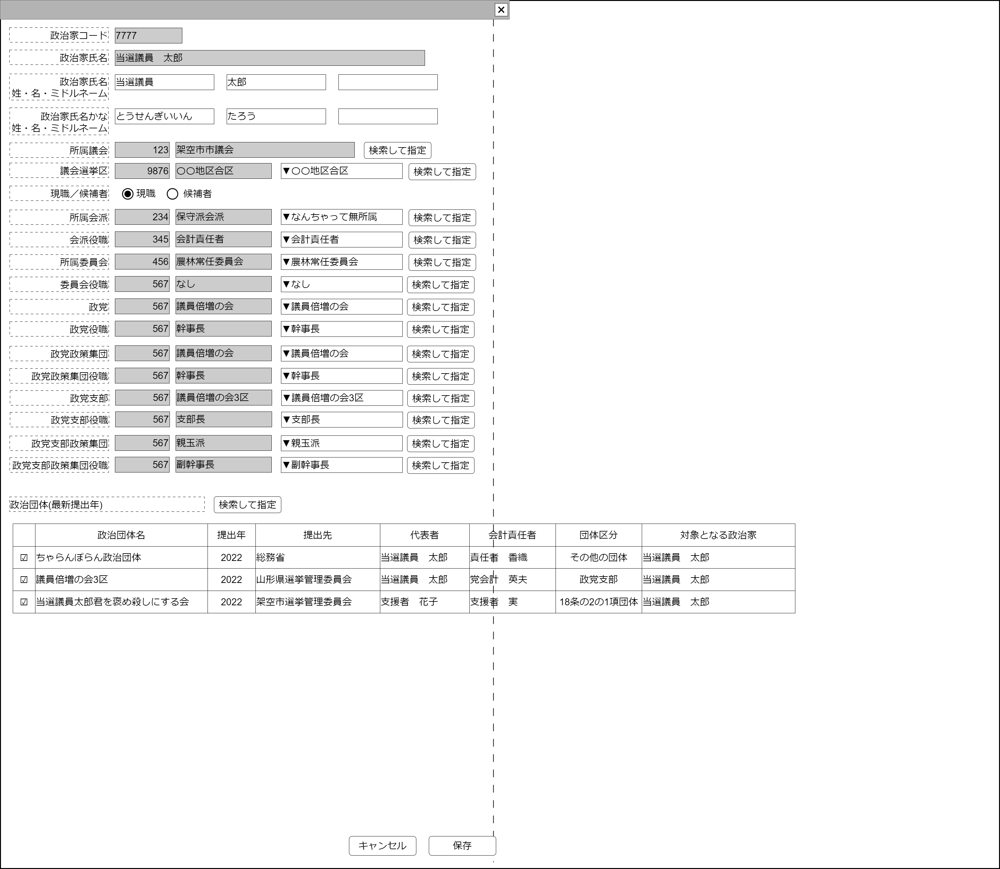

# 政治家管理【表示画面】設計書

## 状態：仕様未確定(実装不可)

## 1.目的

個別の仕分けに対して監査意見を付記する(収入項目)

## 2. 構成コンポーネント

1. 独自フィールド
2. [議会検索コンポーネント](./#)
3. [議会選挙区検索コンポーネント](./#)
4. [議会内会派検索コンポーネント](./#)
5. [役職検索コンポーネント(議会内会派)](./#)
6. [議会内委員会検索コンポーネント](./#)
7. [役職検索コンポーネント(議会内委員会)](./#)
8. [政党検索コンポーネント](./#)
9. [役職検索コンポーネント(政党)](./#)
10. [政党政策集団検索コンポーネント](./#)
11. [役職検索コンポーネント(政党政策集団)](./#)
12. [政党支部検索コンポーネント](./#)
13. [役職検索コンポーネント(政党支部)](./#)
14. [政党支部政策集団検索コンポーネント](./#)
15. [役職検索コンポーネント(政党支部政策集団)](./#)
16. [政治団体検索コンポーネント](./#)

### 2.1 繰り返し項目

なし

## 3. 画面イメージ

### 3.1 画面イメージ

### 3.2 画面イメージ(項番)

## 4. フィールド要素一覧

| 番号 |               論理名               |           タイプ           |          活性／表示          |                                      内容                                      |
| ---- | ---------------------------------- | -------------------------- | ---------------------------- | ------------------------------------------------------------------------------ |
| 1    | 政治家同一識別コード               | インプットテキスト         | 非活性                       | 政治家同一識別コードを表示すること。                                           |
| 1    | 政治家氏名                         | インプットテキスト         | 非活性                       | 政治家氏名を表示すること。                                                     |
| 1    | 政治家氏名かな                     | インプットテキスト         | 非活性                       | 政治家氏名かなを表示すること。                                                 |
| 1    | 政治家氏名(姓)                     | インプットテキスト         | 非活性                       | 政治家氏名の姓の入力を受け付けること                                           |
| 1    | 政治家氏名(名)                     | インプットテキスト         | 非活性                       | 政治家氏名の名の入力を受け付けること                                           |
| 1    | 政治家氏名(ミドルネーム)           | インプットテキスト         | 非活性                       | 政治家氏名のミドルネームの入力を受け付けること                                 |
| 1    | 政治家氏名かな(姓)                 | インプットテキスト         | 非活性                       | 政治家氏名の姓の入力を受け付けること                                           |
| 1    | 政治家氏名かな(名)                 | インプットテキスト         | 非活性                       | 政治家氏名の名の入力を受け付けること                                           |
| 1    | 政治家氏名かな(ミドルネーム)       | インプットテキスト         | 非活性                       | 政治家氏名のミドルネームの入力を受け付けること                                 |
| 1    | 議会同一識別コード                 | インプットテキスト         | 非活性                       | 議会同一識別コードを表示すること                                               |
| 1    | 議会名称                           | インプットテキスト         | 非活性                       | 議会氏名を表示すること                                                         |
| 1    | 議会検索指定ボタン                 | ボタン                     | 活性                         | 押下時：議会検索コンポーネントを表示すること                                   |
| 1    | 議会選挙区同一識別コード           | インプットテキスト         | 非活性                       | 議会選挙区同一識別コードを表示すること                                         |
| 1    | 議会選挙区名称                     | インプットテキスト         | 非活性                       | 議会選挙区氏名を表示すること                                                   |
| 1    | 議会選挙区選択                     | セレクトボックス           | 活性                         | 議会に紐づく選挙区選択の入力を受け付けること                                   |
| 1    | 議会選挙区検索指定ボタン           | ボタン                     | 活性                         | 押下時：議会選挙区検索コンポーネントを表示すること                             |
| 1    | 現職／候補者の別(現職)             | ラジオボタン               | 非活性／非活性               | 下記アクション一覧に記載                                                       |
| 1    | 現職／候補者の別(候補者)           | ラジオボタン               | 非活性／非活性               | 下記アクション一覧に記載                                                       |
| 1    | 議会内会派同一識別コード           | インプットテキスト         | 非活性 表示／非表示       | 議会内会派同一識別コードを表示すること                                         |
| 1    | 議会内会派名称                     | インプットテキスト         | 非活性 表示／非表示       | 議会内会派名称を表示すること                                                   |
| 1    | 議会内会派選択                     | セレクトボックス(複数選択) | 活性／非活性 表示／非表示 | 議会に紐づく議会内会派の選択入力を受け付けること                               |
| 1    | 議会内会派検索指定ボタン           | ボタン                     | 活性／非活性 表示／非表示 | 押下時：議会内会派検索コンポーネントを表示すること                             |
| 1    | 議会内会派役職同一識別コード       | インプットテキスト         | 非活性 表示／非表示       | 議会内会派役職同一識別コードを表示すること                                     |
| 1    | 議会内会派役職名称                 | インプットテキスト         | 非活性 表示／非表示       | 議会内会派役職名称を表示すること                                               |
| 1    | 議会内会派役職選択                 | セレクトボックス(複数選択) | 活性／非活性 表示／非表示 | 議会に紐づく議会内会派役職の選択入力を受け付けること                           |
| 1    | 議会内会派役職検索指定ボタン       | ボタン                     | 活性／非活性 表示／非表示 | 押下時：(議会内会派)役職検索コンポーネントを表示すること                       |
| 1    | 議会内委員会同一識別コード         | インプットテキスト         | 非活性 表示／非表示       | 議会内委員会同一識別コードを表示すること                                       |
| 1    | 議会内委員会名称                   | インプットテキスト         | 非活性 表示／非表示       | 議会内委員会名称を表示すること                                                 |
| 1    | 議会内委員会選択                   | セレクトボックス(複数選択) | 活性／非活性 表示／非表示 | 議会に紐づく議会内委員会の選択入力を受け付けること                             |
| 1    | 議会内委員会検索指定ボタン         | ボタン                     | 活性／非活性 表示／非表示 | 押下時：議会内委員会検索コンポーネントを表示すること                           |
| 1    | 議会内委員会役職同一識別コード     | インプットテキスト         | 非活性 表示／非表示       | 議会内委員会役職同一識別コードを表示すること                                   |
| 1    | 議会内委員会役職名称               | インプットテキスト         | 非活性 表示／非表示       | 議会内委員会役職名称を表示すること                                             |
| 1    | 議会内委員会役職選択               | セレクトボックス(複数選択) | 活性／非活性 表示／非表示 | 議会に紐づく議会内委員会役職の選択入力を受け付けること                         |
| 1    | 議会内委員会役職検索指定ボタン     | ボタン                     | 活性／非活性 表示／非表示 | 押下時：(議会内委員会)役職検索コンポーネントを表示すること                     |
| 1    | 政党同一識別コード                 | インプットテキスト         | 非活性                       | 政党同一識別コードを表示すること                                               |
| 1    | 政党名称                           | インプットテキスト         | 非活性                       | 政党名称を表示すること                                                         |
| 1    | 政党選択                           | セレクトボックス(複数選択) | 活性／非活性                 | 議会に紐づく政党の選択入力を受け付けること                                     |
| 1    | 政党検索指定ボタン                 | ボタン                     | 活性／非活性                 | 押下時：政党検索コンポーネントを表示すること                                   |
| 1    | 政党役職同一識別コード             | インプットテキスト         | 非活性                       | 政党役職同一識別コードを表示すること                                           |
| 1    | 政党役職名称                       | インプットテキスト         | 非活性                       | 政党役職名称を表示すること                                                     |
| 1    | 政党役職選択                       | セレクトボックス(複数選択) | 活性／非活性                 | 議会に紐づく政党役職の選択入力を受け付けること                                 |
| 1    | 政党役職検索指定ボタン             | ボタン                     | 活性／非活性                 | 押下時：(政党)役職検索コンポーネントを表示すること                             |
| 1    | 政党政策集団同一識別コード         | インプットテキスト         | 非活性                       | 政党政策集団同一識別コードを表示すること                                       |
| 1    | 政党政策集団名称                   | インプットテキスト         | 非活性                       | 政党政策集団名称を表示すること                                                 |
| 1    | 政党政策集団選択                   | セレクトボックス(複数選択) | 活性／非活性                 | 議会に紐づく政党政策集団の選択入力を受け付けること                             |
| 1    | 政党政策集団検索指定ボタン         | ボタン                     | 活性／非活性                 | 押下時：政党政策集団検索コンポーネントを表示すること                           |
| 1    | 政党政策集団役職同一識別コード     | インプットテキスト         | 非活性                       | 政党政策集団役職同一識別コードを表示すること                                   |
| 1    | 政党政策集団役職名称               | インプットテキスト         | 非活性                       | 政党政策集団役職名称を表示すること                                             |
| 1    | 政党政策集団役職選択               | セレクトボックス(複数選択) | 活性／非活性                 | 議会に紐づく政党政策集団役職の選択入力を受け付けること                         |
| 1    | 政党政策集団役職検索指定ボタン     | ボタン                     | 活性／非活性                 | 押下時：(政党政策集団)役職検索コンポーネントを表示すること                     |
| 1    | 政党支部同一識別コード             | インプットテキスト         | 非活性                       | 政党支部同一識別コードを表示すること                                           |
| 1    | 政党支部名称                       | インプットテキスト         | 非活性                       | 政党支部名称を表示すること                                                     |
| 1    | 政党支部選択                       | セレクトボックス(複数選択) | 活性／非活性                 | 議会に紐づく政党支部の選択入力を受け付けること                                 |
| 1    | 政党支部検索指定ボタン             | ボタン                     | 活性／非活性                 | 押下時：政党支部検索コンポーネントを表示すること                               |
| 1    | 政党支部役職同一識別コード         | インプットテキスト         | 非活性                       | 政党支部役職同一識別コードを表示すること                                       |
| 1    | 政党支部役職名称                   | インプットテキスト         | 非活性                       | 政党支部役職名称を表示すること                                                 |
| 1    | 政党支部役職選択                   | セレクトボックス(複数選択) | 活性／非活性                 | 議会に紐づく政党支部役職の選択入力を受け付けること                             |
| 1    | 政党支部役職検索指定ボタン         | ボタン                     | 活性／非活性                 | 押下時：(政党支部)役職検索コンポーネントを表示すること                         |
| 1    | 政党支部政策集団同一識別コード     | インプットテキスト         | 非活性                       | 政党支部政策集団同一識別コードを表示すること                                   |
| 1    | 政党支部政策集団名称               | インプットテキスト         | 非活性                       | 政党支部政策集団名称を表示すること                                             |
| 1    | 政党支部政策集団選択               | セレクトボックス(複数選択) | 活性／非活性                 | 議会に紐づく政党支部政策集団の選択入力を受け付けること                         |
| 1    | 政党支部政策集団検索指定ボタン     | ボタン                     | 活性／非活性                 | 押下時：政党支部政策集団検索コンポーネントを表示すること                       |
| 1    | 政党支部政策集団役職同一識別コード | インプットテキスト         | 非活性                       | 政党支部政策集団役職同一識別コードを表示すること                               |
| 1    | 政党支部政策集団役職名称           | インプットテキスト         | 非活性                       | 政党支部政策集団役職名称を表示すること                                         |
| 1    | 政党支部政策集団役職選択           | セレクトボックス(複数選択) | 活性／非活性                 | 議会に紐づく政党支部政策集団役職の選択入力を受け付けること                     |
| 1    | 政党支部政策集団役職検索指定ボタン | ボタン                     | 活性／非活性                 | 押下時：(政党支部政策集団)役職検索コンポーネントを表示すること                 |
| 1    | 政治団体検索指定ボタン             | ボタン                     | 活性                         | 押下時：政治団体検索コンポーネントを表示すること                               |
| 1    | 関係政治団体最新提出年一覧         | テーブル                   | 表示                         | 政治家自身が代表者または支援される政治家に該当する政治団体が一覧されていること |

### 4.1 関係政治団体最新提出年一覧フィールド要素一覧

| 番号 |      論理名      |      タイプ      | 活性／表示 |                                  内容                                  |
| ---- | ---------------- | ---------------- | ---------- | ---------------------------------------------------------------------- |
| 1    | 登録済チェック   | チェックボックス | 非活性     | 政治家記録テーブルにすでに登録されている場合は`true`であること。       |
| 1    | 政治団体名称     | ラベル           | 表示       | 政治団体名称を表示すること。                                           |
| 1    | 提出年           | ラベル           | 表示       | 最新の提出年(システム時間の1年前)をを表示すること。                    |
| 1    | 提出先           | ラベル           | 表示       | 政治団体に紐づく政治資金収支報告書の提出先選挙管理員会を表示すること。 |
| 1    | 代表者           | ラベル           | 表示       | 政治資金収支報告書の代表者を表示すること。                             |
| 1    | 会計責任者       | ラベル           | 表示       | 政治資金収支報告書の会計責任者を表示すること。                         |
| 1    | 団体区分         | ラベル           | 表示       | 政治資金収支報告書の団体区分表示を表示すること。                       |
| 1    | 対象となる政治家 | ラベル           | 表示       | 政治資金収支報告書に記載された支援対象の政治家を表示すること。         |

## 5. アクション一覧

| 番号 |               論理名               |    タイプ    |          活性／表示          |                              内容                              |
| ---- | ---------------------------------- | ------------ | ---------------------------- | -------------------------------------------------------------- |
| 1    | 議会検索指定ボタン                 | ボタン       | 活性                         | 押下時：議会検索コンポーネントを表示すること                   |
| 1    | 議会選挙区検索指定ボタン           | ボタン       | 活性                         | 押下時：議会選挙区検索コンポーネントを表示すること             |
| 1    | 現職／候補者の別(現職)             | ラジオボタン | 非活性／非活性               | 下記アクション一覧に記載                                       |
| 1    | 現職／候補者の別(候補者)           | ラジオボタン | 非活性／非活性               | 下記アクション一覧に記載                                       |
| 1    | 議会内会派検索指定ボタン           | ボタン       | 活性／非活性 表示／非表示 | 押下時：議会内会派検索コンポーネントを表示すること             |
| 1    | 議会内会派役職検索指定ボタン       | ボタン       | 活性／非活性 表示／非表示 | 押下時：(議会内会派)役職検索コンポーネントを表示すること       |
| 1    | 議会内委員会検索指定ボタン         | ボタン       | 活性／非活性 表示／非表示 | 押下時：議会内委員会検索コンポーネントを表示すること           |
| 1    | 議会内委員会役職検索指定ボタン     | ボタン       | 活性／非活性 表示／非表示 | 押下時：(議会内委員会)役職検索コンポーネントを表示すること     |
| 1    | 政党検索指定ボタン                 | ボタン       | 活性／非活性                 | 押下時：政党検索コンポーネントを表示すること                   |
| 1    | 政党役職検索指定ボタン             | ボタン       | 活性／非活性                 | 押下時：(政党)役職検索コンポーネントを表示すること             |
| 1    | 政党政策集団検索指定ボタン         | ボタン       | 活性／非活性                 | 押下時：政党政策集団検索コンポーネントを表示すること           |
| 1    | 政党政策集団役職検索指定ボタン     | ボタン       | 活性／非活性                 | 押下時：(政党政策集団)役職検索コンポーネントを表示すること     |
| 1    | 政党支部検索指定ボタン             | ボタン       | 活性／非活性                 | 押下時：政党支部検索コンポーネントを表示すること               |
| 1    | 政党支部役職検索指定ボタン         | ボタン       | 活性／非活性                 | 押下時：(政党支部)役職検索コンポーネントを表示すること         |
| 1    | 政党支部政策集団検索指定ボタン     | ボタン       | 活性／非活性                 | 押下時：政党支部政策集団検索コンポーネントを表示すること       |
| 1    | 政党支部政策集団役職検索指定ボタン | ボタン       | 活性／非活性                 | 押下時：(政党支部政策集団)役職検索コンポーネントを表示すること |
| 1    | キャンセル                         | ボタン       | 活性                         | 押下時：入力内容を破棄すること                                 |
| 1    | 保存                               | ボタン       | 活性                         | 押下時：入力内容を保存すること                                 |

### 5.1 議会選択指定

a.議会が指定された時

- 議会内会派選択入力が活性であること
- 議会内会派選択入力の選択肢が議会データによりフィルタリングされていること
- 議会内会派検索指定ボタンが非活性であること
- 議会内会派役職選択入力が活性であること
- 議会内会派選役職択入力の選択肢が議会データによりフィルタリングされていること
- 議会内会派役職検索指定ボタンが非活性であること
- 議会内委員会選択入力が活性であること
- 議会内委員会選択入力の選択肢が議会データによりフィルタリングされていること
- 議会内委員会検索指定ボタンが非活性であること
- 議会内委員会役職選択入力が活性であること
- 議会内委員会選役職択入力の選択肢が議会データによりフィルタリングされていること
- 議会内委員会役職検索指定ボタンが非活性であること

b.議会が無指定であるとき

- 議会内会派選択入力が非活性であること
- 議会内会派検索指定ボタンが活性であること
- 議会内会派役職選択入力が非活性であること
- 議会内会派役職検索指定ボタンが活性であること
- 議会内委員会選択入力が非活性であること
- 議会内委員会検索指定ボタンが活性であること
- 議会内委員会役職選択入力が非活性であること
- 議会内委員会役職検索指定ボタンが活性であること

### 5.2 現職／候補者の別

a.現職／候補者の別で現職が選択された時

- 議会内会派に属する項目をすべてが表示されていること
- 議会内会派役職に属する項目をすべてが表示されていること
- 議会内委員会に属する項目をすべてが表示されていること
- 議会内委員会役職に属する項目をすべてが表示されていること

b.現職／候補者の別で現職が選択された時

- 議会内会派に属する項目をすべてが非表示であること
- 議会内会派役職に属する項目をすべてが非表示であること
- 議会内委員会に属する項目をすべてが非表示であること
- 議会内委員会役職に属する項目をすべてが非表示であること

### 5.3 政党選択指定

a.政党が指定された時

- 政党役職選択入力が活性であること
- 政党役職選択入力の選択肢が選択された政党データによりフィルタリングされていること
- 政党役職検索指定ボタンが非活性であること
- 政党政策集団選択入力が活性であること
- 政党政策集団選択入力の選択肢が選択された政党データによりフィルタリングされていること
- 政党政策集団検索指定ボタンが非活性であること
- 政党政策集団役職選択入力が活性であること
- 政党政策集団役職選択入力の選択肢が選択された政党データによりフィルタリングされていること
- 政党政策集団役職検索指定ボタンが非活性であること
- 政党支部選択入力が活性であること
- 政党支部選択入力の選択肢が選択された政党データによりフィルタリングされていること
- 政党支部検索指定ボタンが非活性であること
- 政党支部役職選択入力が活性であること
- 政党支部役職選択入力の選択肢が選択された政党データによりフィルタリングされていること
- 政党支部役職検索指定ボタンが非活性であること
- 政党支部政策集団選択入力が活性であること
- 政党支部政策集団選択入力の選択肢が選択された政党支部データによりフィルタリングされていること
- 政党支部政策集団検索指定ボタンが非活性であること
- 政党支部政策集団役職選択入力が活性であること
- 政党支部政策集団役職選択入力の選択肢が選択された政党支部データによりフィルタリングされていること
- 政党支部政策集団役職検索指定ボタンが非活性であること

b.政党が無指定であるとき

- 政党役職選択入力が非活性であること
- 政党役職検索指定ボタンが活性であること
- 政党政策集団役職選択入力が非活性であること
- 政党政策集団役職検索指定ボタンが活性であること
- 政党支部選択入力が非活性であること
- 政党支部検索指定ボタンが活性であること
- 政党支部役職選択入力が非活性であること
- 政党支部役職検索指定ボタンが活性であること

## 6. 政治家インターフェイス

PoliticianInterface

|                 論理名                 |                 論理名                  |                          型                           |                            説明(例)                            |
| -------------------------------------- | --------------------------------------- | ----------------------------------------------------- | -------------------------------------------------------------- |
| 政治家Id                               | politicianId                            | Long                                                  | 政治家を一意に識別するId。                                     |
| 政治家同一識別コード                   | politicianCode                          | Integer                                               | 変更履歴にかかわらず政治家が同一であることを識別するコード     |
| 政治家名称                             | politicianName                          | String                                                | 政治家名称                                                     |
| 議会Id                                 | parliamentId                            | Long                                                  | 議会を一意に識別するId。                                       |
| 議会同一識別コード                     | parliamentCode                          | Integer                                               | 議会にかかわらず首長選挙が同一であることを識別するコード       |
| 議会名称                               | parliamentName                          | String                                                | 議会名称                                                       |
| 議会選挙区Id                           | electionDistrictId                      | Long                                                  | 議会選挙区を一意に識別するId。                                 |
| 議会選挙区同一識別コード               | electionDistrictCode                    | Integer                                               | 変更履歴にかかわらず議会選挙区が同一であることを識別するコード |
| 議会選挙区名称                         | electionDistrictName                    | String                                                | 議会選挙区名称                                                 |
| 所属議会内会派複数選択リスト           | listParliamentFaction                   | List\<ParliamentFactionLeastInterface\>               | 議会内会派名称                                                 |
| 所属議会内会派役職複数選択リスト       | listParliamentFactionPost               | List\<PostAllHasOrganizationInterface\>               | 議会内会派役職名称                                             |
| 所属議会内委員会複数選択リスト         | listParliamentCommission                | List\<ElectionCommissionLeastInterface\>              | 議会内委員会名称                                               |
| 所属議会内委員会役職複数選択リスト     | listParliamentCommissionPost            | List\<PostAllHasOrganizationInterface\>               | 議会内委員会役職名称                                           |
| 所属政党複数選択リスト                 | listPoliticsParty                       | List\<PoliticsPartyLeastInterface\>                   | 政党名称                                                       |
| 所属政党役職複数選択リスト             | listPoliticsPartyPost                   | List\<PostAllHasOrganizationInterface\>               | 政党役職名称                                                   |
| 所属政党政策集団複数選択リスト         | listPoliticsPartyFaction                | List\<PoliticsPartyFactionLeastInterface\>            | 政党政策集団名称                                               |
| 所属政党政策集団役職複数選択リスト     | listPoliticsPartyFactionPost            | List\<PostAllHasOrganizationInterface\>               | 政党政策集団役職名称                                           |
| 所属政党支部複数選択リスト             | listPoliticsPartySubdivision            | List\<PoliticsPartySubdivisionLeastInterface\>        | 政党支部名称                                                   |
| 所属政党支部役職複数選択リスト         | listPoliticsPartySubdivisionPost        | List\<PostAllHasOrganizationInterface\>               | 政党支部役職名称                                               |
| 所属政党支部政策集団複数選択リスト     | listPoliticsPartySubdivisionFaction     | List\<PoliticsPartySubdivisionFactionLeastInterface\> | 政党支部政策集団名称                                           |
| 所属政党支部政策集団役職複数選択リスト | listPoliticsPartySubdivisionFactionPost | List\<PostAllHasOrganizationInterface\>               | 政党支部政策集団役職名称                                       |
| 政治家関連政治団体リスト               | listOrganization                        | List\<PoliticianOrganization\>                        | 政治家を識別する一意のId                                       |

※セレクトボックスの複数選択であればList\<String\>が取得されるが、政治家テーブルでは各項目についてId,Code,Nameと３つのデータを保存するため、その３種を含むデータを含むInterfaceで設計している

## 7. 連携

TODO すべての連携コンポーネントからの情報を受信すること
