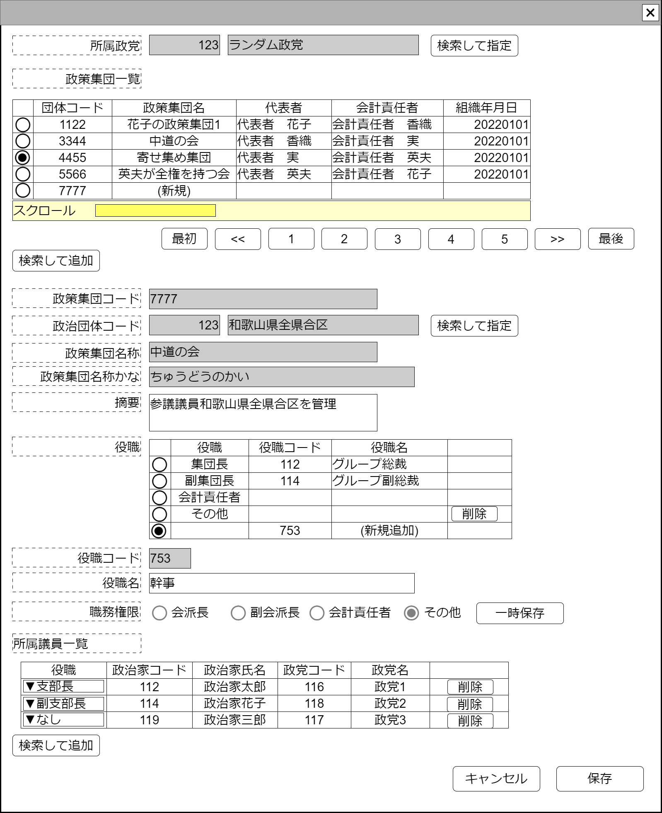

# 政党内政策集団管理【表示画面】設計書

## 状態：仕様未確定(実装不可)

## 1.目的

政党内政策集団情報を編集し登録する

## 2. 構成コンポーネント

1. [政党検索コンポーネント](../../common/front/search_politic_orgnization/search_politic_orgnization.md)
2. [政党政策集団検索コンポーネント](./#)
3. 独自フィールド
4. [役職入力コンポーネント](../../common/front/organization_post_input/organization_post_input.md)
5. [所属議員入力コンポーネント](../../common/front/organization_affiliation_input/organization_affiliation_input.md)

### 2.1 繰り返し項目

なし

## 3. 画面イメージ

### 3.1 画面イメージ

### 3.2 画面イメージ(項番)

## 4. フィールド要素一覧

| 番号 |               論理名               |       タイプ       | 活性／表示 |                             内容                             |
| ---- | ---------------------------------- | ------------------ | ---------- | ------------------------------------------------------------ |
| 1    | 政党同一識別コード                 | ラベル             | 表示       | 政党同一識別コードを表示すること                             |
| 1    | 政党名称                           | ラベル             | 表示       | 政党名称を表示すること                                       |
| 1    | 政党検索ボタン                     | ボタン             | 活性       | 押下時：政党検索コンポーネントを表示すること                 |
| 1    | 政党政策集団表示テーブル           | テーブル           | 表示       | 政党に紐づく政党政策集団一覧を表示すること                   |
| 1    | (政党政策集団を)検索して追加ボタン | ボタン             | 活性       | 押下時：政党政策集団検索コンポーネントを表示すること         |
| 1    | 編集_政党政策集団同一識別コード    | インプットテキスト | 非活性     | 編集中の政党支部同一識別コードを表示すること                 |
| 1    | 編集_政治団体同一識別コード        | インプットテキスト | 非活性     | 編集中の政党支部に紐づく政治団体同一識別コードを表示すること |
| 1    | 編集_政治団体名称                  | インプットテキスト | 非活性     | 編集中の政党支部に紐づく政治団体名称を表示すること           |
| 1    | 政治団体検索ボタン                 | ボタン             | 活性       | 押下時：政治団体検索コンポーネントを表示すること             |
| 1    | 編集_政党政策集団                  | インプットテキスト | 非活性     | 編集中の政党支部に紐づく政治団体名称を表示すること           |
| 1    | 編集_政党政策集団かな              | インプットテキスト | 非活性     | 編集中の政党支部に紐づく政治団体名称かなを表示すること       |
| 1    | 編集_政党政策集団摘要              | テキストエリア     | 活性       | 政党政策集団摘要の入力を受け付けること                       |
| 1    | 組織役職入力コンポーネント         | コンポーネント     | 表示       | 組織役職入力コンポーネントを表示すること                     |
| 1    | 所属議員入力コンポーネント         | コンポーネント     | 表示       | 所属議員入力コンポーネントを表示すること                     |

### 4.1 政党内政策集団表示テーブル フィールド要素一覧

| 番号 |            論理名            |    タイプ    | 活性／表示 |                               内容                               |
| ---- | ---------------------------- | ------------ | ---------- | ---------------------------------------------------------------- |
| 1    | 行選択ラジオボタン           | ラジオボタン | 活性       | 押下時：この行のデータが選択状態であることの入力を受け付けること |
| 1    | 政党内政策集団同一識別コード | ラベル       | 表示       | 政党支部同一識別コードを表示すること                             |
| 1    | 政党内政策集団名称           | ラベル       | 表示       | 政党支部名称を表示すること                                       |
| 1    | 代表者                       | ラベル       | 表示       | 政党支部に紐づく政治団体の代表者を表示すること                   |
| 1    | 会計責任者                   | ラベル       | 表示       | 政党支部に紐づく政治団体の会計責任者を表示すること               |
| 1    | 組織創立日                   | ラベル       | 表示       | 政党支部に紐づく政治団体の創立日を表示すること                   |

## 5. アクション一覧

| 番号 |             論理名             | タイプ | 活性／表示 |                       内容                       |
| ---- | ------------------------------ | ------ | ---------- | ------------------------------------------------ |
| 1    | 政党検索ボタン                 | ボタン | 活性       | 押下時：政党検索コンポーネントを表示すること     |
| 1    | (政策集団を)検索して追加ボタン | ボタン | 活性       | 押下時：政策集団検索コンポーネントを表示すること |
| 1    | 政治団体検索ボタン             | ボタン | 活性       | 押下時：政治団体検索コンポーネントを表示すること |
| 1    | キャンセル                     | ボタン | 活性       | 押下時：入力内容を破棄すること                   |
| 1    | 保存                           | ボタン | 活性       | 押下時：入力内容を保存すること                   |

## 6. 政党内政策集団インターフェイス

PoliticalPartFactionInterface

|            論理名            |             論理名             |   型    |                        説明(例)                        |
| ---------------------------- | ------------------------------ | ------- | ------------------------------------------------------ |
| 政党内政策集団Id             | poriticalPartyPartyFactionId   | Long    | 政党内政策集団を識別する一意のId                       |
| 政党内政策集団同一識別コード | poriticalPartyPartyFactionCode | Integer | 変更履歴にかかわらず政党内政策集団を同一識別するコード |
| 政党内政策集団名称           | poriticalPartyPartyFactionName | Sring   | 政党内政策集団名称。政治団体名称と同一であること       |
| 政党Id                       | poriticalPartyId               | Long    | 政党支部を識別する一意のId                             |
| 政党同一識別コード           | poriticalPartyCode             | Integer | 変更履歴にかかわらず政党支部を同一識別するコード       |
| 政党名称                     | poriticalPartyName             | Sring   | 政党支部名称                                           |
| 政治団体Id                   | poriticalOrganizationId        | Long    | 政党支部を識別する一意のId                             |
| 政治団体同一識別コード       | poriticalOrganizationCode      | Integer | 変更履歴にかかわらず政党支部を同一識別するコード       |
| 政治団体名称                 | poriticalOrganizationName      | Sring   | 政党支部名称                                           |
| 政党内政策集団摘要           | poriticalPartyFactionDigest    | Sring   | 政党支部の摘要                                         |

## 7. 連携

入力内容が変更された都度、入力チェックを行い親画面に変更内容を通知する`emit[sendSampleTemplateInterface(data,errorInfo)]`
