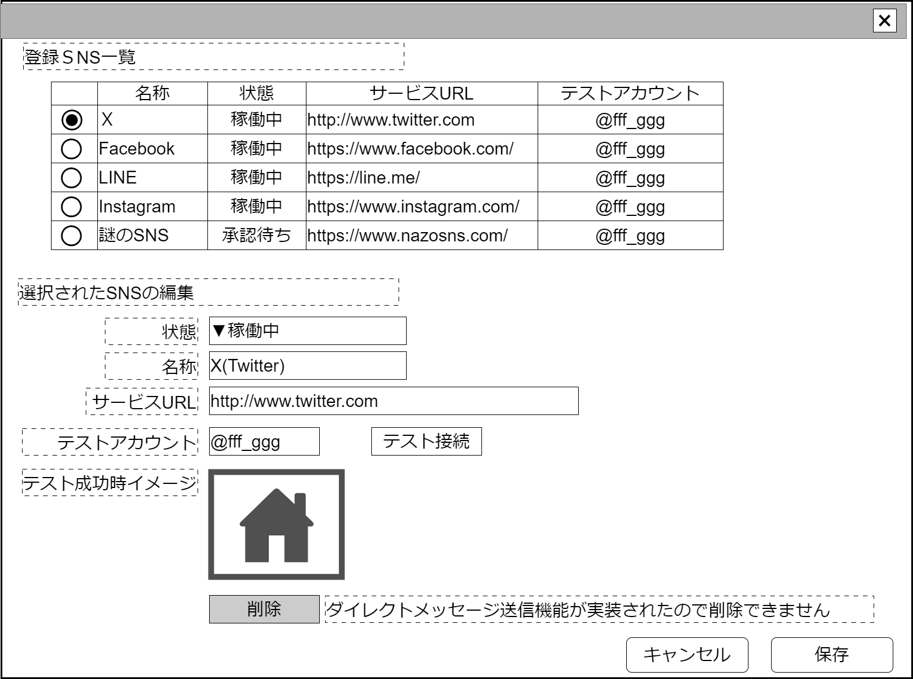

# SNS管理【表示画面】設計書

## 状態：仕様未確定(実装不可)

## 1.目的

登録済SNSアカウントへのアクセス(機能によってはダイレクトメッセージの自動送信)を提供できるようにする情報を管理する

## 2. 構成コンポーネント

1. [登録済SNS一覧テーブル](../../common/front/#)
2. 独自フィールド

### 2.1 繰り返し項目

なし

## 3. 画面イメージ

### 3.1 画面イメージ

### 3.2 画面イメージ(項番)

## 4. フィールド要素一覧

| 番号 |        論理名         |       タイプ       |  活性／表示  |                                                                           内容                                                                           |
| ---- | --------------------- | ------------------ | ------------ | -------------------------------------------------------------------------------------------------------------------------------------------------------- |
| 1    | 登録済SNS一覧テーブル | テーブル           | －           | 登録済のSNS一覧を表示すること。                                                                                                                          |
| 1    | 編集_SNS活動状態      | セレクトボックス   | 活性         | 選択された、SNSの活動状況の入力を受け付けること。                                                                                                        |
| 1    | 編集_SNS名称          | インプットテキスト | 活性         | 選択された、SNS名称の入力を受け付けること。                                                                                                              |
| 1    | 編集_サービスURL      | インプットテキスト | 活性         | 選択された、SNS名称の入力を受け付けること。下記にあるように、アカウント名を付加した時に該当アカウントページが表示できる、サービスのURLを入力が求められる |
| 1    | 編集_テストアカウント | インプットテキスト | 活性         | 選択された、SNSへの接続テストで使用していいアカウントの入力を受け付けること。                                                                            |
| 1    | テスト接続ボタン      | ボタン             | 活性         | 下記アクションリスト参照                                                                                                                                 |
| 1    | テスト接続結果表示    | イメージ           | 表示／非表示 | SNS利用区分が`11:申請中`の場合、表示。条件に該当しない場合は非表示                                                                                       |
| 1    | 削除ボタン            | ボタン             | 活性／非活性 | 下記アクションリスト参照。自動ダイレクトメッセージ有効フラグが`true`の場合は`非活性`(falseの場合活性)                                                    |
| 1    | 削除不可理由表示      | ラベル             | 表示／非表示 | 固定値`ダイレクトメッセージ自動送信機能が実装されているので削除できません`。自動ダイレクトメッセージ有効フラグが`true` の場合表示、`false`の場合非表示   |

## 5. アクション一覧

| 番号 |      論理名      | タイプ |  活性／表示  |                                                                                                      内容                                                                                                      |
| ---- | ---------------- | ------ | ------------ | -------------------------------------------------------------------------------------------------------------------------------------------------------------------------------------------------------------- |
| 1    | キャンセル       | ボタン | 活性         | 押下時：入力内容を破棄すること                                                                                                                                                                                 |
| 1    | 保存             | ボタン | 活性         | 押下時：入力内容を保存すること                                                                                                                                                                                 |
| 1    | テスト接続ボタン | ボタン | 活性         | 自動ダイレクトメッセージ有効フラグが`false`の場合`編集_サービスURL+/+編集_テストアカウント`ページを別タブで表示すること。`true`の場合は実装済の自動DM送信機能を起動して編集_テストアカウントにDMを送信すること |
| 1    | 削除ボタン       | ボタン | 活性／非活性 | 登録済SNS一覧テーブルから該当行を削除すること                                                                                                                                                                  |

## 6. 利用可能SNSインターフェイス

AvailableSnsInterface

 |              論理名              |         物理名          |   型    |                      説明(例)                       |
 | -------------------------------- | ----------------------- | ------- | --------------------------------------------------- |
 | 登録SNSのId                      | snsId                   | Long    | SNSを識別する一意のId                               |
 | 登録SNS同一識別コード            | snsCode                 | Long    | 変更履歴を管理するための同一識別コード              |
 | 登録SNS利用状況区分              | snsStatusKbn            | Integer | サービスが申請中かどうかを表す区分                  |
 | 登録SNS名称                      | snsName                 | String  | SNS名称                                             |
 | 登録SNSのURL                     | snsUrl                  | String  | SNSサービスURL                                      |
 | 登録SNSテスト用アカウント        | snsTestAccount          | String  | 接続確認に使える(申請者自身)のアカウント            |
 | 自動DM送信有効フラグ             | isSendAutoDirectMessage | Boolean | DM自動送信機能が実装されている場合`true`            |
 | 自動DM送信Logic定数              | sendLogicKey            | String  | テスト送信時に自動送信機能Logicを呼び出すためのキー |
 | 申請時テスト接続完了イメージパス | imageSuccessAccess      | String  | 申請時に送信された、テスト接続完了イメージへのパス  |

### 6.1 SNS利用区分

**TODO** 決定次第修正する。作成側ソフトウェアと同一の固定値であること。

|     論理名     |  値  |                                    説明                                    |
| -------------- | ---: | -------------------------------------------------------------------------- |
| 稼働中         |    1 | 稼働中                                                                     |
| DM実装編集不可 |    2 | 自動でダイレクトメッセージを送信する実装を行ったため一切の編集を許可しない |
| 申請中         |   11 | 新規登録直後から接続テストを行って判断が出るまで                           |
| 接続不可却下   |   21 | 接続テストを行ったところ、入力が間違っていたなどで登録を許可しない         |
| 再調査検討     |   22 | その他の不許可状態                                                         |

## 7. 連携

登録済SNS一覧テーブルからのデータ指定内容を`recieveSelectedAvailableSnsInterface(AvailableSnsInterface)`で受信する
