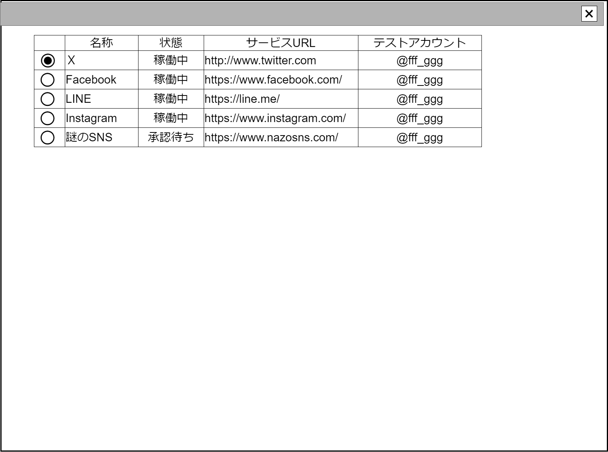

# 登録済SNS一覧テーブル【コンポーネント】設計書

## 状態：仕様未確定(実装不可)

## 1.目的

登録済のSNSを一覧し、選択対象の指定を通知する

## 2. 構成コンポーネント

1. 独自フィールド

### 2.1 繰り返し項目

なし

## 3. 画面イメージ

### 3.1 画面イメージ

### 3.2 画面イメージ(項番)

## 4. フィールド要素一覧

| 番号 |      論理名      |      タイプ      | 活性／表示 |                                 内容                                 |
| ---- | ---------------- | ---------------- | ---------- | -------------------------------------------------------------------- |
| 1    | 行選択ボタン     | ラジオボタン     | 活性       | 登録済SNS一覧テーブル一覧から選択対象を指定すること。                                     |
| 1    | 名称             | ラベル           | -          | 登録済のSNS名称を表示すること。                                      |
| 1    | 状態             | セレクトボックス | 非活性     | 登録済のSNSの活動状況を表示すること。                                |
| 1    | サービスURL      | ラベル           | -          | 登録済のサービスのURLを表示すること。                                |
| 1    | テストアカウント | ラベル           | -          | 登録済のサービスへのアクセスをテストできるアカウントを表示すること。 |

## 5. アクション一覧

フィールド要素に記載した内容で完了

## 6. 利用可能SNSインターフェイス

AvailableSnsInterfaceは[SNS管理【表示画面】](../../../invest_front/regist_sns/regist_sns.md)を参照

## 7. 連携

行選択された場合、親画面に選択された行内容を通知する`emit[sendSelectAvailableSnsInterface(data)]`
