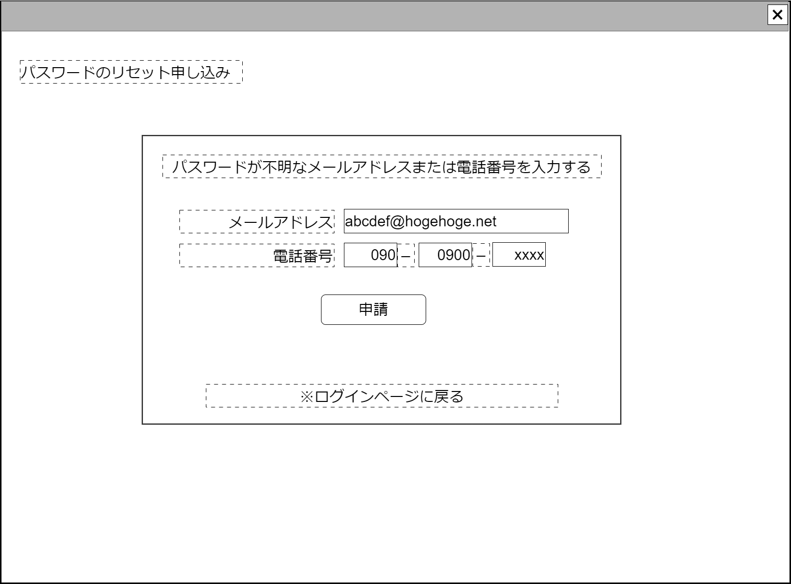

# パスワード初期化申請【表示画面】設計書

## 状態：Mockデータによる仮実装

## 1.目的

パスワードリセットの申請を受け付ける

## 2. 構成コンポーネント

1. 独自フィールド

### 2.1 繰り返し項目

なし

## 3. 画面イメージ

### 3.1 画面イメージ

### 3.2 画面イメージ(項番)

## 4. フィールド要素一覧

| 番号 |        論理名        |       タイプ       | 活性／表示 |                                 内容                                 |
| ---- | -------------------- | ------------------ | ---------- | -------------------------------------------------------------------- |
| 1    | メールアドレス       | インプットメール   | 活性       | メールアドレス(アカウント)の入力を受け付けること                     |
| 1    | 電話番号市外局番     | インプットテキスト | 活性       | 電話番号市外局番の入力を受け付けること                               |
| 1    | 電話番号局番         | インプットテキスト | 活性       | 電話番号局番の入力を受け付けること                                   |
| 1    | 電話番号番号         | インプットテキスト | 活性       | 電話番号番号の入力を受け付けること                                   |
| 1    | ログインページリンク | リンク             | 活性       | 押下時：[ログインページ](../login_user/login_user.md) に遷移すること |

## 5.アクション一覧

| 番号 |        論理名        | タイプ | 活性／表示 |                                                  内容                                                  |
| ---- | -------------------- | ------ | ---------- | ------------------------------------------------------------------------------------------------------ |
| 1    | 申請                 | ボタン | 活性       | 押下時：パスワードリセット処理を行うこと。[ログインページ](../login_user/login_user.md) に遷移すること |
| 1    | ログインページリンク | リンク | 活性       | 押下時：[ログインページ](../login_user/login_user.md) に遷移すること                                   |

## 6. ユーザアカウントインターフェイス

UserAccountInterface

 |       論理名        |          論理名          |               型               |                      説明(例)                       |
 | ------------------- | ------------------------ | ------------------------------ | --------------------------------------------------- |
 | メールアドレス      | loginUserMailAddress     | String                         | ログインユーザのメールアドレス                      |
 | パスワード          | loginUserPassword        | String                         | パスワード                                          |
 | 電話番号1           | loginUserTel1            | String                         | 電話番号市外局番                                    |
 | 電話番号2           | loginUserTel2            | String                         | 電話番号局番                                        |
 | 電話番号3           | loginUserTel3            | String                         | 電話番号番号                                        |
 | 電話識別用コードDto | recognizeTelephonCodeDto | RecognizeTelephonCodeInterface | 電話番号識別をコードを用いて行う場合の場合の情報Dto |

RecognizeTelephonCodeInterface

 |    論理名    |     論理名     |   型   |                             説明(例)                             |
 | ------------ | -------------- | ------ | ---------------------------------------------------------------- |
 | 識別用コード | recoginzedCode | String | 電話番号識別をコードを用いて行う場合の場合の一意に識別するコード |
 | 送信コード1  | codeChar1      | String | 電話番号に送られた識別用のコード1文字目                          |
 | 送信コード2  | codeChar2      | String | 電話番号に送られた識別用のコード2文字目                          |
 | 送信コード3  | codeChar3      | String | 電話番号に送られた識別用のコード3文字目                          |
 | 送信コード4  | codeChar4      | String | 電話番号に送られた識別用のコード4文字目                          |
 | 送信コード5  | codeChar5      | String | 電話番号に送られた識別用のコード5文字目                          |
 | 送信コード6  | codeChar6      | String | 電話番号に送られた識別用のコード6文字目                          |
 | 送信コード7  | codeChar7      | String | 電話番号に送られた識別用のコード7文字目                          |
 | 送信コード8  | codeChar8      | String | 電話番号に送られた識別用のコード8文字目                          |

## 7. 連携

なし
