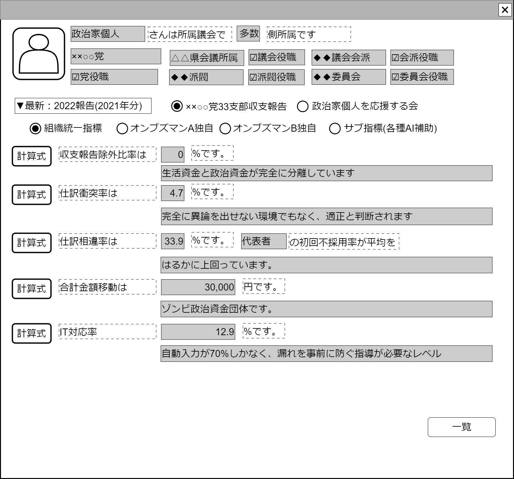

# 収支報告書解析【表示画面】設計書

## 状態：必要に応じて微修正

## 1. 目的

調査のごく基本的な指標を一覧する

## 2. 構成コンポーネント

### 2.1 コンポーネント構成

1.政治家表示コンポーネント
2.独自フィールド
3.収支報告書解析指標表示
4.TODO 各種ボタン未決定

### 2.2 繰り返し項目

3.収支報告書解析指標表示は該当コンポーネントをリスト展開する

## 3.画面イメージ

### 3.1 画面イメージ

### 3.2 画面イメージ(項番)

## 4. フィールド要素一覧

### 4.1 政治家表示コンポーネント

[政治家表示コンポーネント](../../common/front/politician/politician_view_vue.md)を参照

### 4.2 独自フィールド

| 番号 |     論理名     |     タイプ     | 活性／表示 |                          内容                          |
| ---- | -------------- | -------------- | ---------- | ------------------------------------------------------ |
| 1    | 提出年表示選択 | セレクトボタン | 活性       | 選択時：選択された年の調査結果を表示すること           |
| 2    | 資金団体選択   | ラジオボタン   | 活性       | 表示している政治家に紐づく政治団体一覧を表示すること   |
| 3    | 調査項目群     | ラジオボタン   | 活性       | 収支報告書に対して解析手法をグループごとに選択すること |

### 4.3 収支報告書解析指標表示

[収支報告書解析指標表示](survey_indicator_vue.md)を参照

## 5. アクション一覧

| 番号 |      論理名      |      タイプ      | 活性／表示 |                                内容                                |
| ---- | ---------------- | ---------------- | ---------- | ------------------------------------------------------------------ |
| 1    | 閉じる           | ボタン           | 活性       | 押下時：親画面にこのコンポーネントを閉じるよう通知`emit`を送ること |
| 1    | 提出年選択       | セレクトボックス | 活性       | 下記参照                                                           |
| 1    | 資金管理団体選択 | ラジオボタン     | 活性       | 下記参照                                                           |
| 1    | 調査方法選択     | ラジオボタン     | 活性       | 下記参照                                                           |

### 5.1 提出年セレクトボタンを選択

資金管理団体選択ラジオボタンの選択可能項目をフィルタして再表示する
資金管理団体選択ラジオボタンの最初の項目を選択状態にする
調査項目群ラジオボタンを未選択にし、表示されていた表示調査項目があれば破棄する

### 5.2 資金管理団体選択ラジオボタンを選択

提出年の選択オプション項目をフィルタして再表示する
提出年の選択オプションの最初の項目を選択状態する
調査項目群ラジオボタンを未選択にし、表示されていた表示調査項目があれば破棄する

### 5.3 資金管理団体選択ラジオボタンを選択

該当する提出年、資金管理団体の調査を表示する

## 6. 収支報告書解析表示コンポーネントインターフェース

収支報告書解析表示一覧するときに表示する満たすべき要素。

SurveySelecterInterface

 |      論理名      |      論理名       |   型    |                 説明(例)                  |
 | ---------------- | ----------------- | ------- | ----------------------------------------- |
 | データ年         | showYear          | Integer | 例示：2021,2022,2023                      |
 | データ年表示     | showYearText      | String  | 例示：2021年,2022年,2023年                |
 | 資金管理団体Id   | organizaitionId   | Long    | 例示：123                                 |
 | 資金管理団体名称 | organizaitionName | String  | 例示：直接民主制を促進する会資金管理団体1 |

## 7. 連携

子画面から通知された内容を受信する
