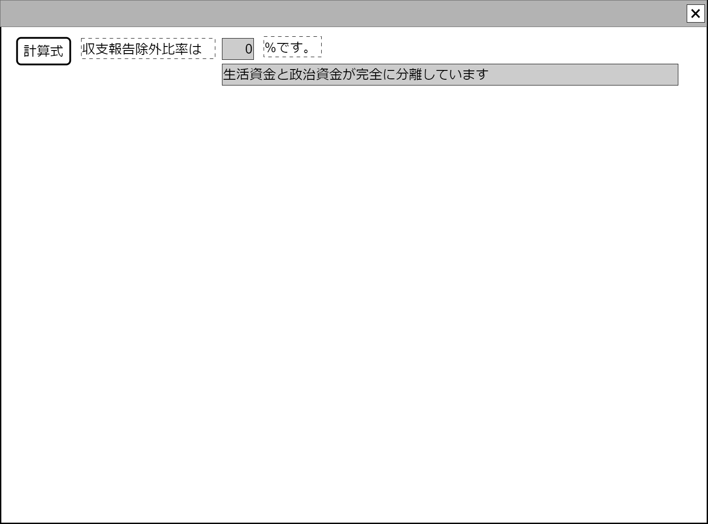

# 収支報告書解析指標表示【コンポーネント】設計書

## 状態：必要に応じて微修正

## 1.目的

個別の仕分けに対して監査意見を付記する(収入項目)

## 2. 構成コンポーネント

1. 独自フィールド
2. 用語ヘルプコンポーネント

### 2.1 繰り返し項目

なし

### 2.2 追加可変

許可(後述)

## 3. 画面イメージ

### 3.1 画面イメージ

### 3.2 画面イメージ(項番)

## 4. フィールド要素一覧

| 番号 |      論理名      | タイプ | 活性／表示 |                                    内容                                    |
| ---- | ---------------- | ------ | ---------- | -------------------------------------------------------------------------- |
| 1    | 計算式           | ボタン | 活性       | 押下時：用語ヘルプコンポーネントを表示すること。                           |
| 2    | 指標タイトル     | ラベル | 非活性     | 指標のタイトルを表示すること。重複不可なのでVer表記などで区別をつけること  |
| 3    | 計算結果         | ラベル | 非表示     | 計算結果を表示すること                                                     |
| 3    | 計算結果テキスト | ラベル | 非活性     | 計算結果を(カンマ区切りなど)必要に応じて表示用にコンバートして使用すること |
| 3    | 計算結果単位     | ラベル | 非活性     | 登録された計算結果単位を表示すること(ex.円・％)                            |
| 5    | 判定詳細         | ボタン | 非活性     | 判定結果詳細を表示すること                                                 |
| x    | 追加指標         | -      | -          | 必要に応じて表示項目を増やす                                               |

## 5. アクション

1. 計算式ボタン

- [用語ヘルプコンポーネント](../../common/front/terminology_help/terminology_help_vue.md)に用語解説を引き渡し`props`して表示すること

## 6. 収支報告書解析表示コンポーネントインターフェース

SurveyIndicatorInterface

 |    論理名    |        論理名         |   型   |                                       説明(例)                                        |
 | ------------ | --------------------- | ------ | ------------------------------------------------------------------------------------- |
 | 計算式       | indicatorExplain      | String | 例示：収支報告除外比率=1年分の書証における報告除外件数/1年分の書証明細件数            |
 | 指標タイトル | indicatorTitle        | String | 例示：収支報告除外比率                                                                |
 | 計算結果     | indicatorAnswer       | Double | 例示：33.7                                                                            |
 | 計算結果     | indicatorAnswerText   | String | 例示：33,000－カンマ区切りなどのように必要に応じてindicatorAnswerをコンバートして格納 |
 | 計算結果単位 | indicatorUnit         | String | 例示：%                                                                               |
 | 判定詳細     | indicatorResultDetail | String | 例示：生活資金と政治資金が完全に分離しています                                        |

## 7. 連携

入力項目がないため親への通知はありません

## 8. 追加コンポーネント

- PG/DB実装が可能なら任意

## 9. 派生する前提

1.計算式をオンライン上から追加する形式はとらない
2.一覧表は上記Interface内容を表示することになり、追加情報は計算式専用コンポーネント他を実装することになる
